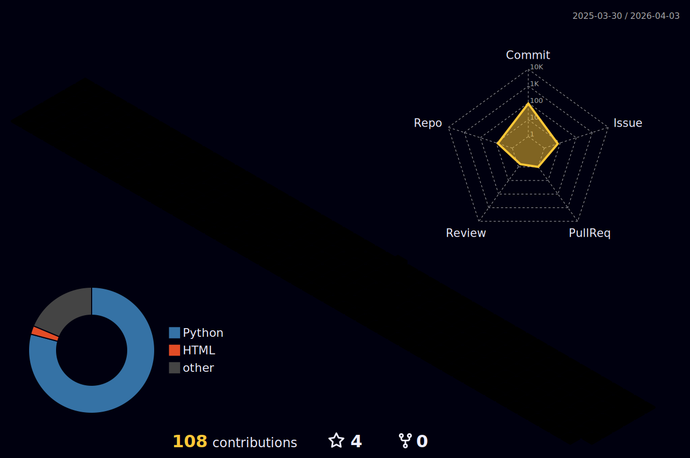

 

---

## 🧠 About Me

I'm a **Software Engineer** specialising in **AI, Machine Learning, and Robotics**, with a deep interest in building systems that are not just intelligent but reliable, efficient, and deployable in the real world.

My work spans the full spectrum: from **bare-metal embedded firmware and hardware interfacing** to **LLM-powered applications and RAG pipelines**. I'm drawn to the hard problems at the intersection of software and the physical world where sensors, models, and decisions have to work together in real time.

<table>
  <tr>
    <td>🔭 <strong>Currently exploring</strong></td>
    <td>AI Agents, RAG pipelines, autonomous robot perception</td>
  </tr>
  <tr>
    <td>🤖 <strong>Deep interest in</strong></td>
    <td>On-device AI, sensor fusion, robot learning, embedded intelligence</td>
  </tr>
  <tr>
    <td>📍 <strong>Based in</strong></td>
    <td>Japan 🇯🇵</td>
  </tr>
</table>

---

## 🛠️ Tech Stack

### 🤖 AI / ML

### 🔗 LLM Systems & Pipelines

### 🦾 Robotics & Embedded

### ⚙️ Infrastructure & Tools

---

## 📊 GitHub Stats

  

---

## 🌐 Contribution Graph

<!-- OPTION: Snake — uncomment to use instead of 3D

<picture>
  <source media="(prefers-color-scheme: dark)" srcset="https://raw.githubusercontent.com/shrikrishnarb/shrikrishnarb/output/github-contribution-grid-snake-dark.svg">
  <source media="(prefers-color-scheme: light)" srcset="https://raw.githubusercontent.com/shrikrishnarb/shrikrishnarb/output/github-contribution-grid-snake.svg">
  
</picture>

-->

<!-- OPTION: 3D Calendar (currently active) -->

  

---

## 📅 Activity

---

